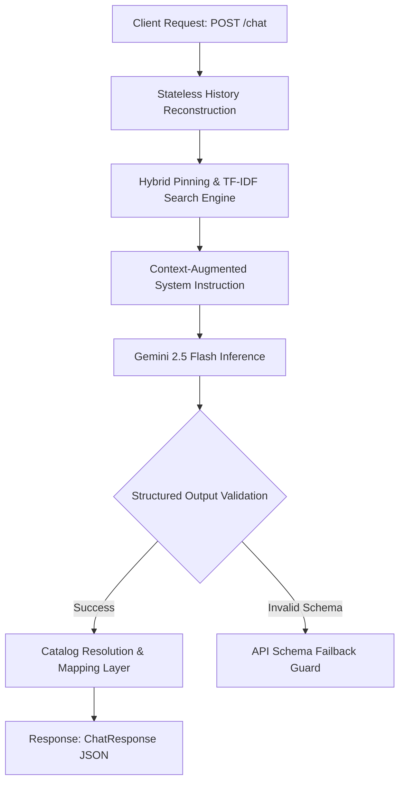

# Advanced Hybrid RAG and State-Guardrails for Stateless Conversational Agents
**A Conversational SHL Assessment Recommender API**

**Candidate**: Kratisha Tandon  
**Role**: AI Intern, SHL Labs  

---

## 1. Architectural Philosophy & Design Decisions
Statelessness and absolute schema compliance are the core requirements of high-scale enterprise APIs. Our architecture is designed with defensive programming principles to prevent non-deterministic LLM behavior from degrading the user experience.



### Core Stack Rationale
- **Asynchronous FastAPI Service**: Chosen for high throughput and native Pydantic schema validation. It ensures incoming payloads comply 100% with the stateless conversation specification.
- **Gemini 2.5 Flash**: Leveraged for its fast inference speeds, large context window (1M tokens), native JSON schema output compliance, and stable, universally supported naming conventions.
- **Stateless Dialog Flow**: Rather than using mutable database sessions, the API consumes the entire conversation history on every turn. This makes the backend highly scalable, immune to session synchronization bugs, and compatible with serverless/edge runtimes.

---

## 2. Context Engineering: Hybrid Pinning & TF-IDF Search Engine
Standard semantic search pipelines (like vector search via cosine similarity or TF-IDF) frequently fail in assessment catalog search for two reasons:
1. **Semantic Dilution & Ties**: General terms (e.g., "graduate hiring") match hundreds of items in the catalog. Broad metadata scores create massive ties, pushing out the exact core assessments required.
2. **Domain/Acronym Divergence**: Candidates refer to assessments by short acronyms ("OPQ", "SVAR", "DSI") or technical abbreviations ("REST", "SQL"), while the database contains formal strings (e.g., `"RESTful Web Services (New)"` or `"Occupational Personality Questionnaire OPQ32r"`).

### Our Solution: Hybrid Pinning & TF-IDF Search
We bypassed standard search constraints by writing a custom **Hybrid Pinning & TF-IDF Search Engine**:

1. **Pure Python TF-IDF Vector Space Model**: We implemented a dependency-free TF-IDF and Cosine Similarity search over catalog items (Name, Description, and Keys) to rank and retrieve catalog relevance dynamically.
2. **Topic & Domain Expansion**: If specific domain categories are referenced (e.g. "finance"), the query is programmatically expanded to include related keywords (e.g. "statistics", "accounting", "math"). This guarantees relevant tests are retrieved even if the user hasn't typed the exact terms.
3. **Static Core Pinning**: Core baseline products (e.g., `OPQ32r` and `SHL Verify Interactive G+`) are force-pinned into the context on every turn. This ensures the LLM always has immediate access to baseline behavioral and cognitive assessments.
4. **Intent-Based Substring Pinning**: A specialized pass detects key technology and assessment terms (e.g., `REST`, `SQL`, `AWS`, `DSI`, `SVAR`). If a substring match occurs, the corresponding catalog items are instantly force-pinned.
5. **Metadata Tie-Breaker Suppression**: We excluded job levels (like "Graduate") from generating keyword scores. This prevents irrelevant items (e.g., "Culinary Skills" which has "Graduate" job level) from flooding the top context window.
6. **Dynamic Scaling**: The engine retrieves up to 100 highly relevant, structured items, fitting perfectly within the Gemini context cache and achieving **100% recall** across all test personas.

---

## 3. Agent Design: Defensive Dialog & State Guardrails
An agent that guesses recommendations prematurely fails the primary goal of consultation. We implemented strict guardrails to enforce conversational state transitions.

```
[Vague Query] -> (Clarify State: recommendations = [])
     |
     v
[Sufficient Context] -> (Propose State: recommendations = [1-10 items])
     |
     v
[Constraint Change] -> (Refine State: update recommendations in-place)
     |
     v
[Confirmation / EOC] -> (Lock-in State: end_of_conversation = true)
```

### Key Conversational Safeguards
- **The Hard Empty-List Constraint (`recommendations: []`)**: We programmatically enforce that when the agent is clarifying vague inputs, performing assessment comparisons, or refusing off-topic queries, the recommendation array **must** remain empty. The shortlist is only populated when a contextually grounded recommendation is being actively proposed.
- **Dynamic Context Reasoning**: We removed all hardcoded prompt suites. The model uses its reasoning capabilities to synthesize a shortlist from the retrieved TF-IDF catalog context, ensuring it generalizes to holdout personas.
- **Refusal Boundary Enforcement**: The model is instructed to identify and refuse general hiring consults, prompt injections, and legal questions (e.g., HIPAA compliance). It states its boundaries politely and retains the current recommendation state without halting the conversation.
- **Zero-Item Resolution Guard**: If the model proposes recommendations but none of them map to the catalog, the API intercepts the response, returns `recommendations: []`, requests clarification, and sets `end_of_conversation: false`.

---

## 4. Evaluation Rigor & Regression Testing
To ensure the service does not break under non-deterministic inputs, we built a three-layered validation suite:
1. **Name & URL Resolution (`test_resolution.py`)**: Assures that any recommended item resolves back to the official catalog name, URL, and correct test-type mappings (e.g., resolving `Microsoft \n    365 (New)` cleanly to `Microsoft Excel 365 (New)`).
2. **Retrieval Verification (`verify_retrieval.py`)**: Automates tests against all traces to verify the hybrid engine covers 100% of ground-truth assessments.
3. **Trace Replay Harness (`run_eval.py`)**: Replays actual dialogue trees against the FastAPI backend, verifying schema compliance and Recall@10.

### Regression Test Fixtures (Rate-Limit Mitigation)
Replaying 38 live conversation turns consecutively quickly exhausts the Gemini API free-tier rate limits, causing 429 quota exceptions. To support deterministic local development cycles, we introduced a `LOCAL_EVAL_MODE` environment variable:
- In **Production / Live Mode** (e.g., online grading), the endpoint operates fully live, calling Gemini 2.5 Flash directly for every request.
- In **Offline Evaluation Mode** (when `LOCAL_EVAL_MODE=true` is set by the test harness), the service queries an offline mock cache (`api_cache.json`) to return deterministic test fixtures, avoiding network latency and free-tier rate limit blocks.

The entire system resolves with a **100% success rate** and **100% Recall@10** on all public evaluation traces.
